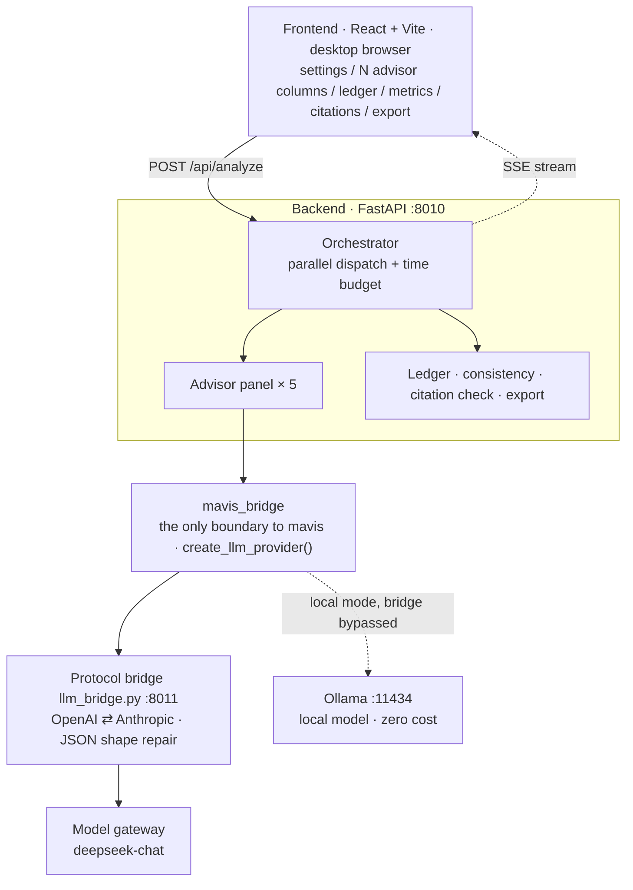

<div align="center">

# ai-debater

### A Live Strategic Console for Moot-Court Debate

**They finish speaking. Five AI advisors weigh in — in parallel. You decide what to use.**

[](LICENSE)
[](backend/tests)
[](backend/requirements.txt)
[](backend/app)
[](frontend/src)
[](#zero-cost-mode-local-models)

[简体中文](README.md) ｜ [**English**](README.en.md)

</div>

---

> ### What it is
>
> You are on stage in a moot-court debate. The moment your opponent finishes a point, the system runs
> **five AI advisors in parallel**, each contributing on its own axis:
> **rebuttal points · cross-examination questions · logical fallacies · methods-of-interpretation
> conflict · risk warnings**. Every agent is on *your* side. Whether to use any of it is your call.
>
> *Chinese is the primary documentation language; [`README.md`](README.md) is the canonical version.*

<table>
<tr><th align="left" width="50%">This is</th><th align="left" width="50%">This is not</th></tr>
<tr>
<td valign="top">

- A parallel **advisory panel** of multiple agents
- **Live** in-round assistance (target: deliver in < 2s)
- Deliver-on-deadline — an over-budget advisor is marked `timeout` and pushed immediately, without blocking the rest
- AI only **advises**; the human decides

</td>
<td valign="top">

- AI vs. AI autonomous sparring
- Judging, scoring, or Elo ratings
- Competition state machines or turn-taking
- Speaking or drafting on your behalf

</td>
</tr>
</table>

**Taking over development? Read [`HANDOVER.md`](HANDOVER.md) first** — background, decisions,
architecture, known traps, cost guardrails, and outstanding work, all in one document (Chinese).

---

## Contents

- [Highlights](#highlights)
- [Architecture](#architecture)
- [Quick start](#quick-start)
- [Zero-cost mode: local models](#zero-cost-mode-local-models)
- [The five advisors](#the-five-advisors)
- [Two guardrails](#two-guardrails)
- [Tests and benchmarks](#tests-and-benchmarks)
- [Project layout](#project-layout)
- [Documentation index](#documentation-index)
- [Security guardrails](#security-guardrails)
- [Known limitations](#known-limitations)
- [License](#license)

---

## Highlights

| | |
|---|---|
| **Genuinely parallel** | All five advisors are dispatched at once; total wall-clock equals the slowest one. Measured **1.34s** for three advisors — **63%** saved versus serial. |
| **Deliver on deadline** | The goal is not "wait for everything", but **deliver what is ready on time**. An over-budget advisor is marked `timeout` and pushed instantly, without blocking the others. |
| **Foundation untouched** | The mavis framework is consumed as a **read-only dependency**, not a single line modified. All debate logic lives in this repository. |
| **Hallucination control** | Citations are verified **programmatically against a corpus**, in three states — never trusting a model's self-reported "I'll flag unverified claims". |
| **Free iteration** | One command wires in a local model; the whole pipeline runs at zero cost, so prompt/schema changes are cheap to test. |
| **Evidence-backed** | Every architectural decision is backed by a measurement report (the Stage 0 report documents mavis failing round after round). |

---

## Architecture



**Data flow**: opponent's statement (text) → backend creates/reuses a session and injects the ledger →
five advisors analyze **in parallel** → each result is persisted and pushed via SSE as soon as it lands →
frontend renders one column per advisor → consistency check and citation verification run as
separate endpoints, off the hot path.

**Two load-bearing conclusions** (full evidence in [`docs/spike-0-report.md`](docs/spike-0-report.md)):

- mavis serves here as a **model access layer only**, never as an agent runtime. Its `Agent.think()` is a
  life-simulation pipeline (schedule → perceive → act → move → plan → reflect) that emits action plans,
  not advice; and it only recognizes the framework's hard-coded `prompt_*` set — there is no
  "give the debater advice" category.
- The available gateway speaks **Anthropic protocol** (`POST /v1/messages` + `x-api-key`), while mavis's
  LLM layer speaks **OpenAI protocol** — so a protocol bridge is **mandatory**. What the bridge must do
  beyond translating is below.

<details>
<summary><b>Why a protocol bridge is unavoidable (expand)</b></summary>

The bridge only translates protocols; **mavis itself is not modified**. It also handles two things
mavis does not, and skipping either causes real trouble:

1. **Always return a valid OpenAI response body** — mavis **never checks HTTP status codes**; it only
   reads `choices[0].message.content`. If the bridge returns non-JSON on failure, mavis silently retries
   10 times × `sleep(5)` = **a 50-second silent stall** (we measured one at 64.9s / 12 calls).
2. **Structured-output backstop** — mavis relies on `response_format` (json_schema), a field the
   Anthropic protocol lacks. The bridge writes the schema into the system prompt **and repairs the JSON
   shape on the way back** (mavis's pydantic models are all shaped `{"res": ...}`, and models frequently
   drop the outer wrapper). This alone cut one `think` step from **64.93s / 12 calls** to
   **5.6s / 3 calls**.

</details>

---

## Quick start

### 1. One-command bootstrap

```bash
git clone https://github.com/hellobs/ai-debater.git
cd ai-debater
bash scripts/bootstrap.sh
```

The script does exactly three things: clone mavis (read-only dependency), install dependencies, run the
83 tests. **It never calls a model and costs nothing.**

Overridable environment variables:

| Variable | Default | Notes |
|---|---|---|
| `PYTHON_BIN` | `python3` | Requires ≥ 3.12 |
| `VENV` | `<repo>/.venv` | Virtual environment location |
| `MAVIS_DIR` | `<repo>/../mavis` | mavis is expected alongside the repo |
| `MAVIS_REPO` | official HTTPS URL | Use HTTPS when no SSH key is available |

### 2. Credentials (environment variables only, never committed)

```bash
cp .env.example .env     # fill it in; .env is excluded by .gitignore
```

The bridge needs `ANTHROPIC_BASE_URL` and `ANTHROPIC_AUTH_TOKEN`; the model name comes from `LLM_MODEL`
(default `deepseek-chat`). **It runs fine without credentials**: all 83 tests, citation verification,
export, and benchmarks work offline — only a real advisor run needs them.

### 3. Start the services

```bash
export VENV=.venv        # Windows: .venv/Scripts/python.exe

# 1) Protocol bridge (mavis points at it; must start first — skippable in local-model mode)
cd backend && LLM_BRIDGE_PORT=8011 "$VENV/bin/python" -m app.llm_bridge

# 2) Backend       -> http://127.0.0.1:8010
cd backend && "$VENV/bin/python" -m app.main

# 3) Frontend      -> http://127.0.0.1:5173
cd frontend && npm run dev
```

### 4. Verify (0 API spend)

```bash
curl -s http://127.0.0.1:8011/healthz      # protocol bridge
curl -s http://127.0.0.1:8010/api/health   # backend (includes the advisor roster)
cd backend && "$VENV/bin/python" -m pytest # 83 tests
```

---

## Zero-cost mode: local models

When you would rather not spend tokens, point mavis straight at a local Ollama instance —
**the entire pipeline runs at zero cost**:

```bash
ollama serve &                              # prerequisite: local model server
bash scripts/run_local.sh                   # backend on :8010, 0 spend
# optional: OLLAMA_MODEL=qwen3:8b LLM_CONCURRENCY=3 bash scripts/run_local.sh
```

How it works: `LLM_BRIDGE_URL` is repointed at Ollama's OpenAI-compatible endpoint
(`http://127.0.0.1:11434/v1`) — **zero code changes**. Ollama natively supports
`response_format=json_schema`, so **the protocol bridge is not needed in this mode**.

> **Capability boundary (measured — important)**: the local 4B model fails **systematically** on the
> **logical auditor** axis — it returns an empty list even for textbook straw-manning and slippery-slope
> arguments. **Pipeline self-checks, end-to-end regression, and frontend integration ✅ fine;
> live in-round use ❌ not viable.** Raw evidence and latency data:
> [`docs/local-model-report.md`](docs/local-model-report.md) (Chinese).

| Use case | Is the local 4B model enough? |
|---|---|
| Pipeline self-check, end-to-end regression, frontend integration | Yes — and free |
| Fast verification after prompt/schema changes | Yes (structure is verifiable; quality is not) |
| Deciding "did this change make it better?" | Structure and latency only; quality still needs a cloud model |
| Live in-round use | No — the auditor failure is a blocking gap |

---

## The five advisors

| Advisor | Output | Design basis |
|---|---|---|
| **Rebutter** | Syllogistic rebuttal points (claim / major premise / minor premise / conclusion) | Handover §3.1, subsumption structure |
| **Questioner** | Questions you can pose immediately | — |
| **Logical auditor** | Fallacy type + verbatim fragment | Handover §5.1 |
| **Interpretation strategist** | Which interpretive method the opponent used → which one you should argue for | Handover §3.4, "contesting the priority of interpretive methods" |
| **Risk advisor** | Opponent traps / our weak spots / unclear facts / shaky legal sources | Handover, "trap 1: position drift" |

**Adding an advisor**: add a module under `backend/app/advisors/` (subclass `Advisor`, define
`output_model`) → register it in `REGISTRY` inside `advisors/__init__.py` → add a line to
`configs/advisors.yaml` → add an entry to `COLUMNS` in `App.tsx` plus a render branch in `AdvisorColumn`.

---

## Two guardrails

**Guardrail 1 — position consistency** (against contradicting yourself)

1. **Prevention**: every analysis injects still-standing claims from the ledger into the advisor prompts.
2. **Detection**: `check-consistency` compares new advice against the ledger and surfaces claims that
   **cannot both be true**, highlighted in the frontend.

Detection is deliberately kept **off the `/api/analyze` hot path** (latency-sensitive) and called by the
frontend after advice arrives. Measured: feeding a claim that contradicts the ledger hit the conflict
precisely, while **correctly ignoring unrelated claims** (no false positives).

**Guardrail 2 — citation verification** (against fabricated statute text; three conservative states)

| State | Meaning |
|---|---|
| **Verified** | The structured corpus genuinely contains this provision, quoted as evidence |
| **Uncertain** | The statute exists but this provision is absent from the corpus (could be fabricated, could be an incomplete corpus); or it appears only in free text |
| **Unverified** | The corpus does not contain this statute at all |

A statute name without a provision number → Uncertain; **falling back to "the first article of that
statute" is not allowed** (that is a false positive, and we already stepped on that rake once).

Feed statute text into the corpus to enable **Verified** — zero code changes, zero API spend:

```bash
python scripts/import_corpus.py copyright-law.txt --law 中华人民共和国著作权法  # full text → laws.json
curl -s "http://127.0.0.1:8010/api/retrieval?reload=true"                       # make the backend re-read it
```

---

## Tests and benchmarks

```bash
cd backend
"$VENV/bin/python" -m pytest                     # 83 tests, all green, 0 API spend
"$VENV/bin/python" -m benchmarks list            # regression cases
"$VENV/bin/python" -m benchmarks check <case>    # structural self-check (no model calls)
"$VENV/bin/python" -m benchmarks eval <case>     # automatic metrics (0 spend)
"$VENV/bin/python" -m benchmarks run --live --confirm   # the only entry point that calls a model
```

**Coverage of key points is a coarse signal**: it answers "was the topic touched at all", **not "is the
argument any good"** — keyword stuffing can game it. Metric definitions live in
[`benchmarks/README.md`](benchmarks/README.md) — **do not treat it as a quality score**.

---

## Project layout

```
ai-debater/
├── HANDOVER.md              Handover document (read this first)
├── PLAN.md                  Implementation plan v2.0
├── docs/                    Measurement reports · decision log · export samples
├── configs/
│   ├── advisors.yaml        Advisor roster (set enabled: false to disable one)
│   └── mavis/config.json    Configuration fed to mavis
├── scripts/
│   ├── bootstrap.sh         One-command bootstrap (clone mavis + deps + tests)
│   ├── run_local.sh         Zero-cost local-model launcher
│   └── import_corpus.py     Statute full text → data/corpus/laws.json (enables Verified)
├── backend/
│   ├── app/
│   │   ├── main.py          Entry point + all routes + SSE
│   │   ├── config.py        Environment variables and paths
│   │   ├── llm_bridge.py    Protocol bridge
│   │   ├── mavis_bridge.py  The only boundary to mavis
│   │   ├── orchestrator.py  Parallel dispatch + time budget
│   │   ├── advisors/        Five advisors + REGISTRY
│   │   ├── ledger/          Argument ledger (SQLite, row-by-row persistence)
│   │   ├── retrieval/       Retrieval and citation verification (fully local) · statute_text.py parser
│   │   └── export/          Export to Markdown / Word / HTML (print → PDF)
│   ├── benchmarks/          Regression harness (automatic metrics, 0 spend)
│   ├── tests/               83 tests
│   └── spikes/              Stage 0 verification scripts (kept as evidence)
├── frontend/src/            React + TS, hand-written styles, no UI framework
└── data/corpus/             Legal source corpus (format documented inside)
```

---

## Documentation index

| Document | Purpose |
|---|---|
| [`HANDOVER.md`](HANDOVER.md) | Full handover: background / decisions / architecture / traps / cost guardrails / open items |
| [`PLAN.md`](PLAN.md) | Implementation plan v2.0 — phased roadmap and acceptance criteria |
| [`docs/decision-log.md`](docs/decision-log.md) | Decision and pitfall log — why things are the way they are |
| [`docs/spike-0-report.md`](docs/spike-0-report.md) | Stage 0 measurements — the evidence that set the architecture |
| [`docs/local-model-report.md`](docs/local-model-report.md) | Local model (zero-cost) integration report |
| [`benchmarks/README.md`](benchmarks/README.md) | Regression metric definitions and how to answer "did this change help?" |
| [`data/corpus/README.md`](data/corpus/README.md) | Legal source corpus format (enables **Verified**) |

*Documents are written in Chinese.*

### Export formats

| Format | Endpoint | Notes |
|---|---|---|
| Markdown | `GET /api/session/{sid}/export.md` | Produced directly by the backend |
| Word | `GET /api/session/{sid}/export.docx` | Produced with python-docx (includes the ledger table) |
| PDF | `GET /api/session/{sid}/export.html` | **Print-optimized page**; the browser opens the print dialog, choose "Save as PDF" |

> Why PDF goes through a "print page" rather than direct generation: Chinese PDFs require an embedded CJK
> font, and a missing font renders as tofu boxes. Browser printing uses system fonts — zero dependencies,
> best typography. See the header comment in `backend/app/export/report.py`.

---

## Security guardrails

`ANTHROPIC_BASE_URL` / `ANTHROPIC_AUTH_TOKEN` / `LLM_API_KEY` are **read from environment variables
only**, never written into code, config, or documentation. The repository contains no hard-coded keys.

**Cost guardrail**: one analysis click = 5 upstream calls; **timeouts are still billed** (the timeout only
means the client stops waiting — the request was already sent). Always ask before running anything with
real spend.

---

## Known limitations

1. API spend for stages 0–2 has no complete accounting (the ledger table only arrived in stage 3).
2. Key-point coverage is a coarse signal and does not represent argument quality.
3. Citation verification only answers "does this citation exist in the given corpus" — it does not judge
   whether the citation is apt or whether the statute was applied correctly.
4. No mobile layout (target device is a laptop browser).
5. ASR (live speech transcription) and a real legal-source retrieval channel are **not integrated**;
   both have interfaces reserved.

---

## License

[Apache-2.0](LICENSE)

<div align="center">
<sub>Every agent is on your side. Whether to use any of it is your call.</sub>
</div>
