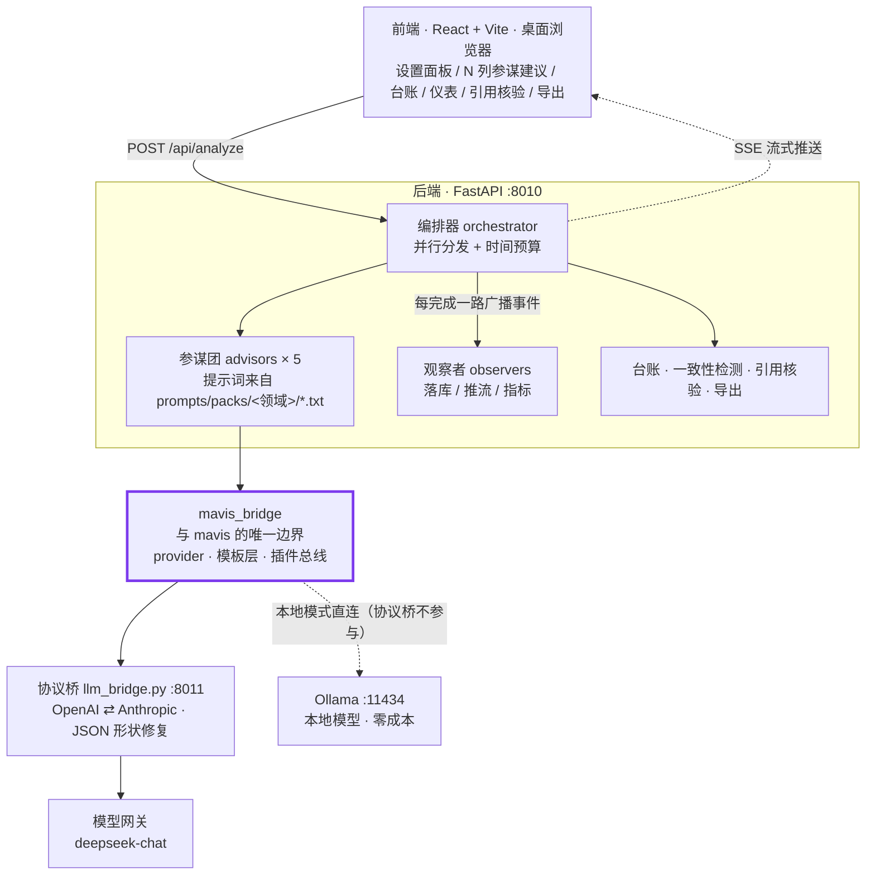

<div align="center">

# ai-debater

### 多智能体辩论参谋台 · 以「AI + 法学」为落地场景

**对方陈述结束后，五路参谋智能体并行产出建议；建议的采纳由使用者裁定。**

**本项目基于 [`mavisframework`](https://github.com/hellobs/mavis) v1.3.3 开发。**
该框架以只读依赖（editable install）接入，受测仓库一行未改 ——
因此本项目同时构成对该框架的一次**可复现的实地检验**（field test）。

[](docs/mavis-gap-report.md)
[](LICENSE)
[](backend/tests)
[](backend/requirements.txt)
[](backend/app)
[](frontend/src)
[](#5-零成本运行本地模型)

[**简体中文**](README.md) ｜ [English](README.en.md)

</div>

---

> **摘要**
>
> 本项目是一个多智能体辩论参谋系统。给定辩题、我方立场与对方发言，系统**并行**调度五路
> 参谋智能体，分别产出反驳要点、质询问题、逻辑谬误指认、衡量尺度之争与风险提示，
> 并在**时限预算内交付已就绪的部分**。全部智能体与使用者立场一致；建议的采纳与否，由使用者裁定。
>
> 与此同时，本项目构成一次**框架实地检验**。系统**基于**
> [`mavisframework`](https://github.com/hellobs/mavis)（生成式智能体仿真框架，v1.3.3）**开发**，
> 该框架以只读依赖接入、一行未改，故检验结论对**框架本身**成立。实测结果：
> 3 个能力面被完整承载（模型接入 / 提示词模板 / 插件总线），**仿真半边架构性不适用**，
> 其间识别出 **7 处缺口**（G1–G7）与 4 处接线注意（N1–N4），每项附复现命令。
>
> → [1. 框架实地检验](#1-框架实地检验mavis-field-test) ｜
> [检验报告](docs/mavis-gap-report.md)

**范围界定**

<table>
<tr><th align="left" width="50%">本系统覆盖</th><th align="left" width="50%">本系统不覆盖</th></tr>
<tr>
<td valign="top">

- 多智能体**并行参谋**，各自产出一路建议
- **现场**实时辅助（目标：2s 内交付）
- 到点交付 —— 超预算的一路标记 `timeout`，不阻塞其余
- AI 仅**产出建议**，决策权归使用者

</td>
<td valign="top">

- AI 对 AI 的自动互搏
- 裁判打分 / 胜负判定 / Elo 评级
- 辩论赛制状态机、发言权交替
- 代替使用者上台或定稿

</td>
</tr>
</table>

**接手开发请先读 [`HANDOVER.md`](HANDOVER.md)** —— 背景 / 决策 / 架构 / 已知陷阱 / 成本红线 / 待办，一份讲透。

---

## 目录

- [1. 框架实地检验（mavis field test）](#1-框架实地检验mavis-field-test)
- [2. 主要特性](#2-主要特性)
- [3. 系统架构](#3-系统架构)
- [4. 快速开始](#4-快速开始)
- [5. 零成本运行：本地模型](#5-零成本运行本地模型)
- [6. 辩题与立场配置](#6-辩题与立场配置)
- [7. 五路参谋](#7-五路参谋)
- [8. 两道校验闸](#8-两道校验闸)
- [9. 测试与回归评估](#9-测试与回归评估)
- [10. 项目结构](#10-项目结构)
- [11. 文档索引](#11-文档索引)
- [12. 安全与成本红线](#12-安全与成本红线)
- [13. 已知局限](#13-已知局限)
- [14. 来源与致谢](#14-来源与致谢)

---

## 1. 框架实地检验（mavis field test）

[`mavisframework`](https://github.com/hellobs/mavis) 是一套**生成式智能体仿真框架**（v1.3.3）。
本项目**基于它开发**，把它置于基础设施层使用 —— 于是本项目同时成为该框架在**真实产品场景下的
一次实地检验**。

### 1.1 检验设置与前提

| 项 | 内容 |
|---|---|
| 受测版本 | mavis v1.3.3（commit `511dea0`） |
| 接入方式 | 只读依赖（`pip install -e`）——**受测仓库零改动** |
| 样本 | 单案例 · 单版本 · 单任务形态（见 [13. 已知局限](#13-已知局限)） |
| 报告 | [`docs/mavis-gap-report.md`](docs/mavis-gap-report.md)（含研究问题、判定标准、严重度分级、复现命令） |

检验的前提是**零改动**：框架以只读依赖接入，仓库一行未改。该约束保证**内部效度** ——
以下每条结论都只能归因于框架本身，而非"改动之后的效果"。

### 1.2 被完整承载的能力面

| 能力面 | mavis 入口 | 本项目落点 | 承载内容 |
|---|---|---|---|
| **模型接入** | `create_llm_provider()` → `LLMProvider` | `backend/app/mavis_bridge.py` | `completion()` 的 `caller` / `failsafe` / `callback` 三个参数全部使用，另接 `is_available()` / `get_summary()` / `cache_stats()` 入 `/api/health`；复用其进程级并发闸，并把它内置的单次调用超时（默认 90s）变成 `LLM_TIMEOUT_S` 可调 |
| **提示词模板** | `prompt.Scratch.build_prompt()` | `prompts/` + `advisors/base.py` | 三层模板（`layout` + 领域包 `packs/<包>/{roles,tasks}`），提示词由 Python 长字符串转为**可 diff、可版本化、可按领域替换**的数据；启动时 `preload()` **遍历每个包**自检 |
| **插件总线** | `plugin.PluginManager` | `backend/app/observers.py` | 三个观察者 `LedgerPlugin` / `StreamPlugin` / `MetricsPlugin`，获得**逐插件错误隔离**与 `setup / emit / teardown` 生命周期 |

### 1.3 承担了不可替代功能的两处设计

- **`failsafe` 哨兵**：框架的 `completion()` 吞掉全部异常（见缺口 G3）。默认 `failsafe=None` 时，
  "上游不可达"与"模型返回空内容"在调用方看来**无从区分** —— 二者的返回值仅是 `None` 与 `''` 之别，
  而任何按空值归并结果的判定都会把它们收进同一分支。传入私有哨兵 `FAILED` 后，
  "上游重试耗尽"成为一个可比较的身份，二者才被拆分为 `error` / `empty` —— 这一区分对现场决策是必需的。
- **`callback` 的语义约束**：框架把 callback 返回 `None` 解释为"本次不计入，重试一次"。
  因而在 callback 中否决内容，会把"质量一般"放大为 `retry` 倍的上游调用。
  `Advisor.adapt()` 据此**只做归一化**（去空白、丢全空条目），不做判分。

### 1.4 架构性不适用的半边：仿真

框架的主体是 `Agent` / `Game` / `Simulator` / 记忆 / 日程 / 空间 —— 一套**生活仿真管线**。
在本案例中，这半边属于**架构性错位**，而非配置不当：

- `Simulator` 的语义是"每 tick 令全部 Agent 走一遍生活仿真"，与"五路并行出主意"不同；
- `Agent.think()` 只识别框架写死的一组 `prompt_*`，产物是行动计划而非建议文本 ——
  **不存在"向辩手给出建议"这一类**。

逐轮实测过程见 [`docs/spike-0-report.md`](docs/spike-0-report.md)。

### 1.5 缺口清单（G1–G7）

全部由 `backend/spikes/mavis_bounds.py` 实测复现，**只报告，不修改 mavis**。
所提改进建议均符合框架自身的扩展约定（纯新增 / 默认关闭 / 语义中立 / 附单测）。

| # | 缺口 | 性质 |
|---|---|---|
| **G1** | 结果缓存的调用名白名单硬编码（`_CACHEABLE_CALLERS`），接入方无法登记自己的确定性调用 | 影响本项目 |
| **G2** | 全局并发闸为类属性，`size` 一变即整体重建，两个 `concurrency` 不同的 provider 会互相顶掉闸门 | 潜在正确性 |
| **G3** | `completion()` 吞掉全部异常，且退避 `sleep(5)` 硬编码：最坏先睡 50s 才放弃 | 影响时间预算 |
| **G4** | `Scratch` / `Plugin` / `PluginManager` 未进入顶层 `__all__`，"推荐用法"中找不到扩展入口 | 影响接入方 |
| **G5** | `validate_message()` 只接受内建 7 种消息，与 `PluginManager.emit()`（不校验）契约不一致 | 文档缺失 |
| **G6** | `Scratch` 借用成本偏高：构造需三个用不上的位置参数，模板目录冻结在实例上 | 人体工程 |
| **G7** | `get_summary()` 的 `R` 并非重试次数（仅在成功取得响应时递增），字面含义会误导读数 | 影响读数 |

另有 4 条**接线注意（N1–N4）**：`failsafe` 不传则无法区分失败类型；`cache_stats()` 不在抽象基类中；
模板中的裸 `$` 会引发异常；`discover()` 只自动实例化无参构造的工厂。逐条说明见报告。

### 1.6 边界机制

"换掉 mavis 只需改一个文件"不是修辞，由测试维持：

- `backend/app/` 下**仅 `mavis_bridge.py`** 允许 `import mavisframework` ——
  `test_only_the_bridge_imports_mavisframework` 以 AST 扫描全目录强制此约束；
- 且仅允许访问顶层 / `plugin` / `prompt` 三个公开路径 ——
  `test_bridge_only_uses_public_surface` 再锁一层，禁止触达 `runtime.llm` 等内部模块。

### 1.7 复现

```bash
# 11 个探针（G1–G7 + N1–N4；只读，零上游调用）
.venv/Scripts/python.exe backend/spikes/mavis_bounds.py

# 一致性测试：探针仍能复现 + 编号与严重度与检验报告对齐
cd backend && ../.venv/Scripts/python.exe -m pytest tests/test_mavis_gap_report.py -v

# 34 项"仅用公开面 / 仅有一个接触面"的测试
cd backend && ../.venv/Scripts/python.exe -m pytest tests/test_mavis_usage.py -v
```

### 1.8 立场

只使用已公开的稳定面，不触碰框架源码。7 条缺口无一条属于"不可回避" ——
G1、G4、G7 值得框架侧修复，G2 为潜在正确性问题，其余属文档与人体工程范畴。
将结论与证据留存于仓库，是为了使后续"是否修改 mavis / 是否替换 mavis"的讨论**有据可依**，
而不必重新通读源码。

---

## 2. 主要特性

| | 说明 |
|---|---|
| **框架实地检验** | 本项目**基于 mavis v1.3.3 开发**，同时构成其一次实地检验：仿真半边架构性不适用（有证据），基础设施半边被用满。全程零改动，产出 [7 处缺口报告](docs/mavis-gap-report.md) —— 见 [1. 框架实地检验](#1-框架实地检验mavis-field-test) |
| **真并行** | 五路参谋同时发起，总墙钟等于最慢一路。三路实测 **1.34s**，较串行节省 **63%** |
| **到点交付** | 目标不是"全部返回"，而是**按时交付已就绪的部分**。超预算的一路标记 `timeout` 并立即推送，不阻塞其余 |
| **不改基座** | 框架以**只读依赖**接入，一行未改；`backend/app/` 下仅一个文件允许 import 它，由 AST 测试守护 |
| **防幻觉** | 引用核验由**程序核对语料**判定三态，并比对模型**引述内容与原文的重合度**；不采信模型自称的"我会标注待核验" |
| **零成本迭代** | 一条命令接入本地模型，整条链路不产生费用，可放心修改 prompt / schema |
| **数据持久化** | 现场工作状态（辩题 / 立场 / 对方发言 / 预算 / 会话）自动存本机并随刷新恢复——对方发言不再说第二遍；**语料界面导入**：粘贴或选文件即结构化入库，引用核验立刻生效（入仓语料含 8 部法律，克隆即得「已核验」） |
| **语音输入（流式）** | 对方发言可由麦克风录入：**边说边出字**（流式 Zipformer，WebSocket，端点自动分段），结束后全文落进可编辑输入框，**人工核对后才提交**，不自动触发分析。纯本地推理，**0 API 消耗、离线可用**；批式 SenseVoice 端点保留给脚本与高精度转写 |
| **有证据链** | 每个架构决策均有实测报告支撑（阶段 0 报告记录了框架逐轮失败的完整过程） |

---

## 3. 系统架构



> 图中紫色的 **`mavis_bridge`** 是**唯一**允许 `import mavisframework` 的文件 ——
> 这是"替换 mavis 只需改一个文件"的全部依据，由 AST 测试守护。
> 详见 [1. 框架实地检验](#1-框架实地检验mavis-field-test)。

**数据流**：对方发言（文本）→ 后端建/取会话并注入台账 → 五路参谋**并行**分析 →
各路算完即经 mavis 插件总线广播至三个观察者（落库 / 推流 / 指标）→ 前端多列展示 →
一致性检测与引用核验（独立端点，不在热路径内）。

**三项承重结论**（完整证据见 [`docs/spike-0-report.md`](docs/spike-0-report.md) 与
[`docs/mavis-gap-report.md`](docs/mavis-gap-report.md)）：

- 框架在本项目中**仅承担基础设施层**，不作为 Agent 运行时。其 `Agent.think()` 是"日程 → 感知 → 定行动 → 移动 → 计划 → 反思"的生活仿真管线，产物为行动计划而非建议文本，且只识别框架写死的 `prompt_*` 集合 —— 不存在"向参谋给出建议"这一类。
- 其**基础设施半边被用满**：模型接入（`LLMProvider` 的重试 / 超时 / 并发闸 / 逐 caller 计数 / 失败哨兵）、提示词模板（`Scratch` 三层 `.txt`）、插件总线（`PluginManager` 的逐插件错误隔离）。`backend/app/` 下**仅 `mavis_bridge.py`** 允许 import `mavisframework`，由 AST 测试守护。
- 可用网关仅提供 **Anthropic 协议**（`POST /v1/messages` + `x-api-key`），而框架的 LLM 层只说 **OpenAI 协议** —— 因此协议桥**必须存在**。桥承担的、框架自身不做的工作见下。

<details>
<summary><b>为什么协议桥不可或缺（展开）</b></summary>

桥只做协议翻译，**不修改 mavis**。它还承担框架自身不做、缺失即会导致故障的两件事：

1. **始终返回合法的 OpenAI 响应体** —— 框架**不检查 HTTP 状态码**，只读 `choices[0].message.content`。桥在出错时若返回非 JSON，框架将走 10 次重试 × `sleep(5)` = **50 秒静默失败**（实测一次 64.9s / 12 次调用）。
2. **结构化输出兜底** —— 框架依赖 `response_format`(json_schema) 获取结构化结果，而 Anthropic 协议无此字段。桥将 schema 写入系统提示，**并对返回结果做 JSON 形状修复**（框架的 pydantic 模型统一形如 `{"res": ...}`，模型常丢失外层包装）。此项将一步 `think` 由 **64.93s / 12 次调用**降至 **5.6s / 3 次**。

</details>

---

## 4. 快速开始

### 4.1 一键引导

```bash
git clone https://github.com/hellobs/ai-debater.git
cd ai-debater
bash scripts/bootstrap.sh
```

脚本只做三件事：克隆 mavis（只读依赖）、安装依赖、跑一遍全量测试。
**它不调用任何模型，不产生任何费用。**

> 想用**语音输入**（可选）：`bash scripts/fetch_asr_model.sh` 一次性下载两套转写模型
> （批式 + 流式，共约 420MB，走 hf-mirror 国内直连）。不下也不影响其余功能，界面会如实提示。

可用环境变量覆盖默认值：

| 变量 | 默认 | 说明 |
|---|---|---|
| `PYTHON_BIN` | `python3` | 需要 ≥ 3.12 |
| `VENV` | `<仓库>/.venv` | 虚拟环境目录 |
| `MAVIS_DIR` | `<仓库>/../mavis` | mavis 放在仓库同级 |
| `MAVIS_REPO` | 官方 HTTPS 地址 | 没有 SSH key 时使用 HTTPS |

### 4.2 凭据（仅走环境变量，绝不入仓）

```bash
cp .env.example .env     # 填写后生效；.env 已被 .gitignore 排除
```

协议桥需要 `ANTHROPIC_BASE_URL` 与 `ANTHROPIC_AUTH_TOKEN`，模型名走 `LLM_MODEL`（默认 `deepseek-chat`）。
**无凭据亦可运行**：全量测试、引用核验、导出、回归评估全部离线可用，仅"真跑一轮参谋"需要凭据。

### 4.3 启动服务

```bash
# 用绝对路径 —— 下面几条会 cd，相对路径到那一步就不对了
PY="$PWD/.venv/bin/python"      # Windows: PY="$PWD/.venv/Scripts/python.exe"

# 1) 协议桥（mavis 指向它，必须最先启动；本地模型模式下可跳过）
cd backend && LLM_BRIDGE_PORT=8011 "$PY" -m app.llm_bridge

# 2) 后端          → http://127.0.0.1:8010
cd backend && "$PY" -m app.main

# 3) 前端          → http://127.0.0.1:5173
cd frontend && npm run dev
```

### 4.4 验证（0 API 消耗）

```bash
curl -s --noproxy '*' http://127.0.0.1:8011/healthz      # 协议桥
curl -s --noproxy '*' http://127.0.0.1:8010/api/health   # 后端（含基座自述、参谋团名册、提示词包）
curl -s --noproxy '*' http://127.0.0.1:8010/api/topics   # 辩题库
cd backend && "$PY" -m pytest                            # 全量测试

# 提示词包是否真的按领域切开了（零上游调用：本地渲染两套包对比）
"$PY" -c "
import sys; sys.path.insert(0,'backend')
from app.advisors import REGISTRY
from app.advisors.base import DebateContext
adv = REGISTRY['strategist']()
ctx = DebateContext('t','正方','对方说完了。',domain='通用')
print(adv.build_prompt(ctx)[:60])                      # 通用措辞
ctx.domain = 'AI + 法学'
print(adv.build_prompt(ctx)[:60])                      # 法学措辞
"
```

> `--noproxy '*'`：本机端口不该走系统代理，否则会被拦成 `os error 10061`。

---

## 5. 零成本运行：本地模型

当不希望消耗 token 时，令框架直连本机 Ollama，**整条链路零费用**：

```bash
ollama serve &                              # 前置：本地模型服务
bash scripts/run_local.sh                   # 后端 :8010，0 消耗（默认 qwen3:8b）
# 显存紧张时退回 4B（代价见下方边界）：
#   OLLAMA_MODEL=qwen3:4b-instruct-2507-q4_K_M bash scripts/run_local.sh
```

原理：将 `LLM_BRIDGE_URL` 指向 Ollama 的 OpenAI 兼容端点（`http://127.0.0.1:11434/v1`），
**零代码改动**；Ollama 原生支持 `response_format=json_schema`，
故**此模式下无需启动协议桥**。脚本会自动把时间预算放宽到 120s（见下方边界）。

> **能力边界（实测，重要）**：**4B 在逻辑审计员一路上系统性失效**
> —— 面对教科书级的以偏概全 / 偷换概念亦返回空列表。
> **8B 修复了这一路**（同一批案例全部识别），代价是**慢约 5 倍**：
> 五路并行从 9.74s 涨到约 50s，按默认 20s 预算会有 3–4 路被判超时。
> **因此本地路线定位为离线 / 备赛通道 ✅；现场那 20 秒 ❌ 仍只有云端模型给得起。**
> 原始证据与延迟数据见 [`docs/local-model-report.md`](docs/local-model-report.md) §9。

| 用途 | 4B（2.5GB） | 8B（5.2GB） |
|---|---|---|
| 链路自检、端到端回归、前端联调 | 完全够用，且零成本 | 够用，但一轮要等约 50s |
| 修改 prompt / schema 后的快速验证 | 够用（结构可验证，质量不可信） | 更好（质量也可参考） |
| 逻辑审计员这一路 | 系统性失效 | 已修复 |
| 现场实战（默认 20s 预算） | 不可行（审计员失效） | 不可行（3–4 路超时） |
| 离线 / 备赛（预算放宽） | 可用 | **推荐** |

---

## 6. 辩题与立场配置

辩题不是界面上临时输入的字符串，而是**可预置、可复用的一项资产** ——
辩题、双方立场、对方最可能的首句，三者绑定。

```yaml
# configs/topics.yaml（入仓预设，编辑此文件即为"提前配置"）
topics:
  - id: ai-copyright
    domain: AI + 法学
    title: AI 生成内容是否应享有著作权
    side_a: 控方（主张应享有）      # 选定辩题后自动成为"我方立场"
    side_b: 辩方（主张不应享有）
    opponent_hint: 著作权法只保护自然人的智力成果，AI 不是人……   # 一键填入"对方刚说的话"
    note: 独创性判断标准与权利主体适格性。
```

> ⚠️ `domain` 是**逐字匹配** `configs/prompt-packs.yaml` 里 `domains` 列表的键 —— 它决定用哪套提示词包。
> 新起的领域名不会被拒绝，但会落到默认包（`general`）；若它值得一套自己的措辞，就把它加进 `prompt-packs.yaml`。

- **`configs/topics.yaml`** —— 入仓预设，团队共享，手写即配置；
- **`data/topics.json`** —— 界面「保存为我的辩题」所存的一份，**不入仓**（与 `ledger.db` 同一约定）；
- 运行时两者**并集**返回，同 `id` 时本机覆盖预设。**库为空即返回空**，界面退化为纯自由输入。

```bash
curl -s http://127.0.0.1:8010/api/topics          # 取整个辩题库
# 存一条本机辩题（id 留空则按标题自动生成，同标题覆盖）
curl -s -X POST http://127.0.0.1:8010/api/topics \
  -H 'content-type: application/json' \
  -d '{"title":"大学应当把人工智能设为必修课","side_a":"正方","side_b":"反方"}'
curl -s -X DELETE http://127.0.0.1:8010/api/topics/local-1a2b3c4d   # 只能删除本机那份
```

### 6.1 通用平台，而非法学专用

平台定位为**通用辩手参谋台**，「AI + 法学」是落地场景之一：

- **辩题带 `domain`**，界面按场景分组（`通用` / `AI + 法学` / `我的辩题`）；
- **领域差异由「提示词包」承担**（见 §6.2）：辩题的 `domain` 决定五路参谋用哪一套措辞，
  而不是靠"哪一路不上场"来区分领域 —— 通用辩题同样跑满五路；
- 品牌、导出报告标题、`advisors.yaml`、`topics.yaml`、`schemas.py` 中均无"法学"二字的硬编码。

### 6.2 领域提示词包（`prompts/packs/`）

**没有包的时候是什么样**：提示词只有一份，且按法学写 —— 反驳手被要求"大前提 = 法律规范"、
风险提示员要找"法源不稳"。非法律题（例如教育类的题目）走同一条路，
于是模型也拿法律框架推理。这不报错，只是让输出悄悄换了个学科视角。

**现在**：领域措辞被关进包里，按辩题领域选包。

```
prompts/layout.txt                     总装骨架（与领域无关，两个包共用）
prompts/packs/legal/roles|tasks/*.txt  法学：法律涵摄 + 法律解释方法
prompts/packs/general/roles|tasks/*.txt 通用：三段论 + 衡量尺度 + 依据核验
configs/prompt-packs.yaml              domain → 包的映射（改配置，不改代码）
```

三条设计约束：

1. **法学辩题零回归**。`legal` 包里的 10 份模板是从原来 `prompts/{roles,tasks}/` **逐字节**
   搬过来的（提交里显示为纯 rename，0 行增删），措辞一个字没动。
2. **不猜包**。`domain` 精确匹配；没被认领的与自由输入（无 `domain`）一律落**默认包**，
   并写一条 debug 日志。猜错时提示词会安静地换成另一套框架 —— 那是最难发现的一类错。
3. **一个包必须自包含**。两份包里 `auditor` / `questioner` 逐字节相同，这不是重复：
   一个包之所以能被单独替换，前提就是它自带完整的 5×2 份模板。少一份
   `preload()` 在启动时就报错，**任何一个包缺文件都拦得住**，不用等第一个法学辩题进来。

> **顺带找出的第二、第三条泄漏路径**（只改提示词是不够的）：
> - `schemas.py` 的字段描述会被 mavis 塞进 `response_format.json_schema` **一起发给模型**
>   （`mavisframework/runtime/llm_providers.py`）。「大前提：所依据的法律规范（法条名称+条款号）」
>   写的不是注释，是提示词。现在这些描述只写跨领域都成立的话，学科词汇与取值枚举
>   交给包（「取值见任务说明」）。
> - `advisors.yaml` 与参谋类里的显示名。`解释方法策略师` 已改为领域中立的 `论证策略师`，
>   名册里的 `domain: 法学` 标记一并解除。
>
> 三条路径都有测试守着：`test_prompt_packs.py` 断言通用包里不出现法学措辞、
> 输出模型的 json_schema 里不出现法学措辞。

⚠️ **仍未解耦的一层**：`retrieval/`（法源检索与引用核验）按设计就是法学专用的 ——
它要判的是"这条引用在法典里是否真的存在"。通用辩题下这一面板不适用，但**不会误导**
（它只核验引用，不参与生成）。要泛化它属于另一件事，见 [`HANDOVER.md`](HANDOVER.md) 的待办。

**换包实测**：同一道非法律辩题「大学应当把人工智能设为必修课」（预设库已收敛为
「AI + 法学」单一领域，这条需自由输入；实测记录保留当时的输入），**只换 `domain`**（⇒ 只换包），
反驳手的**大前提**在 general 包下落回教育学判断（「大学教育目标具有多元性…」），
在 legal 包下被拽向**法条**（「（待核验：高等教育法关于本科教育应使学生掌握现代科技文化知识…的规定）」）——
而那条款与此题无关。**"选错包"的代价不是报错，是具体可见的错配依据**，
这正是选包坚持精确匹配、绝不猜的理由。

```bash
.venv/Scripts/python.exe backend/spikes/pack_quality.py --dry-run   # 只看两包提示词差异（0 消耗）
.venv/Scripts/python.exe backend/spikes/pack_quality.py             # 真跑：2 包 × 3 路 = 6 次调用
```

只跑三路是因为 `auditor` / `questioner` 两包内逐字节相同，跑它们只是白花钱。
⚠️ 这一轮只说明**换包确实改变产出**；**没有**证明"通用包产出更好"（单题、单次、无盲评）。

---

## 7. 五路参谋

五路都上场（任何领域都跑满五路），**领域措辞由包提供**：

| 参谋 | 产出 | general 包 | legal 包 | 设计依据 |
|---|---|---|---|---|
| **反驳手** | 四段式反驳要点（主张 / 大前提 / 小前提 / 结论） | 大前提 = 公认原则或一般性判断 | 大前提 = 法律规范（条款项） | 交接文档 §3.1 |
| **质询手** | 可立即抛出的质询问题 | 领域无关 | 领域无关 | — |
| **逻辑审计员** | 谬误类型 + 原话片段 | 领域无关 | 领域无关 | 交接文档 §5.1 |
| **论证策略师** | 对方所用尺度/方法 → 我方应主张的优先性 | 事实认定 / 概念界定 / 价值排序 / 后果权衡 | 文义 / 体系 / 目的 / 历史 / 合宪性解释 | 交接文档 §3.4 |
| **风险提示员** | 对方陷阱 / 我方薄弱 / 事实不清 / 依据是否稳 | 依据不稳 | 法源不稳 | 交接文档「坑 1 立场漂移」 |

**新增一路参谋**：在 `backend/app/advisors/` 新增模块（继承 `Advisor` 并定义 `output_model`）→
在 `advisors/__init__.py` 的 `REGISTRY` 注册 → `configs/advisors.yaml` 增一行 →
`AdvisorColumn.tsx` 增渲染分支。**前端无需改名册**（它读 `/api/health`）。

`configs/advisors.yaml` 是名册的**唯一来源**：`label` / `kind` / `domain` 均在此覆盖，
`enabled: false` 可临时停用某一路，**列表顺序即界面顺序**。

---

## 8. 两道校验闸

**闸一 · 立场一致性**（防"自相矛盾"）

1. **预防**：每次分析将台账中仍成立（`standing`）的主张注入参谋提示词；
2. **检测**：`check-consistency` 将新建议与台账比对，找出**不能同时为真**的冲突，前端标红。

检测**刻意不置于 `/api/analyze` 热路径**（现场延迟敏感），由前端在建议返回后再调一次。
实测：故意喂入一条与台账相反的主张 → 准确命中冲突，同时**正确放过无关主张**（无误报）。

**闸二 · 引用核验**（防法条幻觉，三态保守判定）

| 状态 | 含义 |
|---|---|
| **已核验** | 结构化语料中确有该条，附原文为证 |
| **存疑** | 该法存在但语料中无该条（可能编造，也可能语料不全）；或仅出现于自由文本 |
| **未核验** | 语料中不存在该法 |

仅给出法名而无条款号 → 判为存疑，**不得以"该法首条"兜底**（那是假阳性，已踩过一次）。

**第二条正交轴 · 内容一致性。** 条款号真实存在，不表明模型为其配置的条文内容正确 ——
实测中模型曾写出真实条款号 + 编造内容，旧版仍判「已核验」。因此核验时另抽取引用之后
紧随的"声称内容"，与语料原文做**最长公共子串重合度**比对：

| 重合度 | 界面表现 |
|---|---|
| ≥ 45% | 不额外提示（意译概括通常亦可通过） |
| < 45% | 标记「引述待查」，给出重合度，并将**模型引述**与**语料原文**并排展示 |

该轴**不改变上述存在性判定** —— 两个维度正交。低重合仅表明"模型的话与原文对不上"，
可能源于编造，也可能源于合理意译，**由人判断**（与产品定位一致：AI 仅出主意，决策权在人）。
阈值由后端随报告下发，前端不自行复制该数值。

将法条写入语料即可启用「已核验」，**零代码改动、零 API 消耗**：

```bash
python scripts/import_corpus.py 著作权法.txt --law 中华人民共和国著作权法   # 全文 → laws.json
curl -s "http://127.0.0.1:8010/api/retrieval?reload=true"                  # 令后端重读语料
```

---

## 9. 测试与回归评估

```bash
cd backend
PY="../.venv/bin/python"      # Windows: PY="../.venv/Scripts/python.exe"
"$PY" -m pytest                                  # 全绿，0 API 消耗
"$PY" -m benchmarks list                         # 回归用例
"$PY" -m benchmarks check <case>                 # 结构自检（不调模型）
"$PY" -m benchmarks eval <case>                  # 自动指标（0 消耗）
"$PY" -m benchmarks run --live --confirm         # 按用例批量真跑（会产生费用）
```

**要点覆盖率是粗信号**：它只回答"话题是否被触及"，**不回答"论证是否成立"**，关键词可堆砌术语刷分。
指标口径见 [`benchmarks/README.md`](benchmarks/README.md) —— **不可当作质量分使用**。

---

## 10. 项目结构

```
ai-debater/
├── HANDOVER.md              交接文档（先读这份）
├── PLAN.md                  实施计划 v2.0
├── docs/                    实测报告 · 决策记录 · mavis 缺口报告 · 导出样例
├── prompts/                 提示词（经 mavis 的 Scratch 模板层渲染）
│   ├── layout.txt           总装顺序：$directive / $context / $task（与领域无关）
│   └── packs/<包>/          领域提示词包，每包含完整的 roles/ + tasks/
│       ├── legal/           法学：法律涵摄 + 法律解释方法
│       └── general/         通用（默认包）：三段论 + 衡量尺度 + 依据核验
├── configs/
│   ├── advisors.yaml        参谋团名册（唯一来源：label/kind/domain 均在此修改）
│   ├── topics.yaml          预设辩题库（辩题 + 双方立场 + 对方例句 + 领域）
│   ├── prompt-packs.yaml    领域 → 提示词包 的映射（唯一来源）
│   └── mavis/config.json    ⚠️ 历史遗留，运行时不再读取
├── scripts/
│   ├── bootstrap.sh         一键引导（克隆 mavis + 安装依赖 + 跑测试）
│   ├── run_local.sh         本地模型零成本启动
│   └── import_corpus.py     法律全文 → data/corpus/laws.json（启用「已核验」）
├── backend/
│   ├── app/
│   │   ├── main.py          入口 + 全部路由 + SSE
│   │   ├── config.py        环境变量与路径
│   │   ├── llm_bridge.py    协议桥
│   │   ├── mavis_bridge.py  与 mavis 的唯一接触面（provider / 模板层 / 插件总线）
│   │   ├── prompt_packs.py  领域提示词包：domain → 用哪一套参谋措辞
│   │   ├── observers.py     三个观察者：落库 / 推流 / 指标
│   │   ├── orchestrator.py  并行编排 + 时间预算 + 事件广播
│   │   ├── topics.py        辩题库（预设 + 本机自建）
│   │   ├── advisors/        五路参谋 + REGISTRY
│   │   ├── ledger/          论点台账（SQLite，逐条落库）
│   │   ├── retrieval/       检索与引用核验（纯本地）· statute_text.py 法条文本解析
│   │   └── export/          导出 Markdown / Word / HTML(打印→PDF)
│   ├── benchmarks/          回归评估框架（自动指标 0 消耗）
│   ├── tests/               全量测试
│   └── spikes/              阶段 0 验证脚本 · mavis_bounds.py（缺口复现入口）· pack_quality.py（换包实测）
├── frontend/src/            React + TS，手写样式，无 UI 框架
└── data/corpus/             法源语料（格式见其中 README）
```

---

## 11. 文档索引

| 文档 | 作用 |
|---|---|
| [`CONTRIBUTING.md`](CONTRIBUTING.md) | **接手先读**：文档阅读顺序 + 七条硬约束 + 最小改动闭环（0 消耗） |
| [`docs/mavis-gap-report.md`](docs/mavis-gap-report.md) | 框架适用性评估（技术报告体）：可用三面 / 7 处缺口（G1–G7）/ 4 条接线注意，含严重度分级、局限与复现命令 |
| [`HANDOVER.md`](HANDOVER.md) | 交接全景：背景 / 决策 / 架构 / 已知陷阱 / 成本红线 / 待办 |
| [`PLAN.md`](PLAN.md) | 实施计划 v2.0，含分阶段路线与验收标准 |
| [`docs/decision-log.md`](docs/decision-log.md) | 工程决策记录 —— 为什么如此定 |
| [`docs/spike-0-report.md`](docs/spike-0-report.md) | 阶段 0 技术报告：决定架构走向的关键证据 |
| [`docs/local-model-report.md`](docs/local-model-report.md) | 本地模型（零成本）接入实测 |
| [`benchmarks/README.md`](benchmarks/README.md) | 回归指标含义与"改动是否更好"如何回答 |
| [`data/corpus/README.md`](data/corpus/README.md) | 法源语料格式（放入法条即可启用「已核验」） |

### 11.1 导出格式

| 格式 | 端点 | 说明 |
|---|---|---|
| Markdown | `GET /api/session/{sid}/export.md` | 后端直接产出文件 |
| Word | `GET /api/session/{sid}/export.docx` | 后端用 python-docx 产出（含台账表格） |
| PDF | `GET /api/session/{sid}/export.html` | **打印优化页面**，浏览器唤起打印对话框，选"存储为 PDF" |

> PDF 之所以走"打印页"而非直接生成：中文 PDF 需内嵌 CJK 字体，缺字体将渲染为方块；
> 浏览器打印使用系统字体，零依赖、排版最优。见 `backend/app/export/report.py` 顶部说明。

---

## 12. 安全与成本红线

`ANTHROPIC_BASE_URL` / `ANTHROPIC_AUTH_TOKEN` / `LLM_API_KEY` **仅从环境变量读取**，
绝不写入代码、配置或文档。仓库内无任何硬编码密钥。

**成本红线**：点击一次分析 = 5 次上游调用；**超时同样计费**（超时仅表示本地不再等待，请求已发出）。
任何会产生真实消耗的测试，须先询问。

---

## 13. 已知局限

1. 阶段 0–2 的 API 消耗无完整账目（账本表于阶段 3 才加入）。
2. 要点覆盖率为粗信号，不代表论证质量。
3. 引用核验回答两件事：引用在语料中**是否存在**、模型**引述内容与原文的重合度**。
   它**不判断**引用是否恰当、法条是否被正确适用，也不替人裁定低重合究竟源于编造还是意译。
4. 前端未做移动端适配（目标设备为笔记本浏览器）。
5. 真实法源检索通道**未接入**（已预留接口）。语音转写**一期已完成**（批式：本地
   SenseVoice，0 API 消耗，转写结果由人工校对后提交）；**流式识别未做**，
   「识别完成自动触发分析」是刻意不做的——以什么文本去问参谋，决策权在人。
6. 框架实地检验为**单案例、单版本、单任务形态**的观测，结论不宜直接外推至框架的全部使用场景 ——
   详见 [检验报告 §6 局限](docs/mavis-gap-report.md)。

---

## 14. 来源与致谢

本项目的**基础设施半边**（模型接入 / 提示词模板 / 插件总线）**基于**
[`mavisframework`](https://github.com/hellobs/mavis) **开发**。该框架以只读依赖接入，
仓库零改动；本项目对其公开接口的使用范围、暴露的缺口与复现方式，
完整记录于 [`docs/mavis-gap-report.md`](docs/mavis-gap-report.md)。

对本仓库的引用建议注明基座关系，例如：

> ai-debater —— 一个多智能体辩论参谋平台，基于 mavisframework v1.3.3 开发。

---

## 许可证

[Apache-2.0](LICENSE)

<div align="center">
<sub>全部智能体与使用者立场一致。建议的采纳与否，由使用者裁定。</sub>
</div>
