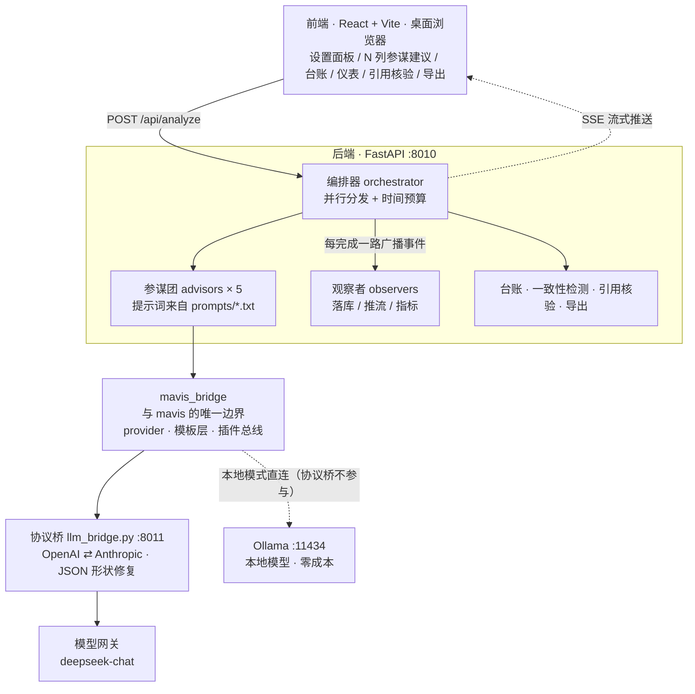

<div align="center">

# ai-debater

### 通用辩手参谋台 · 落地 AI + 法学

**对方说完一段，五路 AI 参谋并行出主意 —— 用不用，你说了算。**

[](LICENSE)
[](backend/tests)
[](docs/mavis-gap-report.md)
[](backend/requirements.txt)
[](backend/app)
[](frontend/src)
[](#零成本运行本地模型)

[**简体中文**](README.md) ｜ [English](README.en.md)

</div>

---

> ### 它是什么
>
> 你站在台上打辩论。对方说完一段，系统**并行**跑五路 AI 参谋，各自给你出主意：
> **反驳要点 · 质询问题 · 逻辑谬误 · 解释方法之争 · 风险提示**。
> 全部 Agent 站在你这一边，用不用由你判断。
>
> ### 它还是个实战检验
>
> 它同时是 [`mavis`](https://github.com/hellobs/mavis)（生成式智能体仿真框架 v1.3.3）
> **在真实产品里的实战检验**：哪些面能承重、哪些面不能，以及还缺什么。
> 检验全程**零改动**——mavis 以只读依赖接入，一行未改，所以结论对框架本身有效。
> → [mavis 实战检验](#mavis-实战检验) ｜ [检验报告](docs/mavis-gap-report.md)

<table>
<tr><th align="left" width="50%">这是</th><th align="left" width="50%">这不是</th></tr>
<tr>
<td valign="top">

- 多 Agent **并行参谋团**，各出一路主意
- **现场**实时辅助（目标：< 2s 内交付）
- 到点就交付——超预算的那路标 `timeout`，不拖住其余
- AI 只**出主意**，决策权在人

</td>
<td valign="top">

- AI 对 AI 自动互搏
- 裁判打分 / 胜负判定 / Elo
- 辩论赛制状态机、发言权交替
- 替人上台、替人定稿

</td>
</tr>
</table>

**接手开发请先读 [`HANDOVER.md`](HANDOVER.md)** —— 背景 / 决策 / 架构 / 已知坑 / 成本红线 / 待办，一份讲透。

---

## 目录

- [亮点](#亮点)
- [架构](#架构)
- [**mavis 实战检验**](#mavis-实战检验)
- [快速开始](#快速开始)
- [零成本运行：本地模型](#零成本运行本地模型)
- [辩题与立场：提前配置](#辩题与立场提前配置)
- [五路参谋](#五路参谋)
- [两道闸：防立场漂移与引用核验](#两道闸防立场漂移与引用核验)
- [测试与回归评估](#测试与回归评估)
- [项目结构](#项目结构)
- [文档索引](#文档索引)
- [安全红线](#安全红线)
- [已知局限](#已知局限)
- [许可证](#许可证)

---

## 亮点

| | 说明 |
|---|---|
| **mavis 实战检验** | 本项目同时是 mavis v1.3.3 的**实战检验**：仿真半边架构性不适用（有证据），基础设施半边用满。全程零改动，产出 [7 处缺口报告](docs/mavis-gap-report.md) —— 见 [mavis 实战检验](#mavis-实战检验) |
| **真并行** | 五路参谋同时发起，总墙钟 = 最慢那一路。三路实测 **1.34s**，较串行省 **63%** |
| **到点交付** | 关键不是"全部返回"，而是**按时交付已就绪的部分**。超预算的一路标 `timeout` 立刻推送，不阻塞其他 |
| **不改底座** | mavis 框架以**只读依赖**接入，一行未改；`backend/app/` 下只有一个文件允许 import 它，有测试用 AST 守着 |
| **防幻觉** | 引用核验由**程序核对语料**判定三态，不采信模型自称的"我会标注待核验" |
| **零成本迭代** | 一条命令接本地模型，整条链路不产生任何费用，可放心改 prompt / schema |
| **有证据链** | 每个架构决策都有实测报告兜底（阶段 0 报告记录了 mavis 逐轮失败的完整过程） |

---

## 架构



**数据流**：对方发言（文本）→ 后端建/取会话 + 注入台账 → 五路参谋**并行**分析 →
各路算完即经 mavis 插件总线广播给三个观察者（落库 / 推流 / 指标）→ 前端多列展示 →
一致性检测与引用核验（独立端点，不进热路径）。

**两个关键判断**（详细证据见 [`docs/spike-0-report.md`](docs/spike-0-report.md) 与
[`docs/mavis-gap-report.md`](docs/mavis-gap-report.md)）：

- mavis 在本项目中**只当基础设施层**，不当 Agent 运行时。它的 `Agent.think()` 是"日程 → 感知 → 定行动 → 移动 → 计划 → 反思"的生活仿真管线，产物是行动计划而非建议文本，且只认框架写死的 `prompt_*` 集合——没有"给参谋出主意"这一类。
- 而它的**基础设施半边是用满的**：模型接入（`LLMProvider` 的重试 / 超时 / 并发闸 / 逐 caller 计数 / 失败哨兵）、提示词模板（`Scratch` 三层 `.txt`）、插件总线（`PluginManager` 的逐插件错误隔离）。`backend/app/` 下**只有 `mavis_bridge.py`** 允许 import `mavisframework`，有测试用 AST 守着。
- 可用网关只提供 **Anthropic 协议**（`POST /v1/messages` + `x-api-key`），而 mavis 的 LLM 层只会说 **OpenAI 协议**——**必须**有一个协议桥，且桥不做不行的那两件事见下。

<details>
<summary><b>为什么必须有一个协议桥（展开）</b></summary>

桥只做协议翻译，**不改 mavis**。它还负责两件 mavis 自己不做的事，缺了会真出事：

1. **永远返回合法的 OpenAI 响应体** —— mavis **不检查 HTTP 状态码**，只读 `choices[0].message.content`。桥若出错时返回非 JSON，mavis 会走 10 次重试 × `sleep(5)` = **50 秒静默失败**（实测过一次 64.9s / 12 次调用）。
2. **结构化输出兜底** —— mavis 靠 `response_format`(json_schema) 拿结构化结果，而 Anthropic 协议没有该字段。桥把 schema 写进系统提示，**并对返回做 JSON 形状修复**（mavis 的 pydantic 模型统一形如 `{"res": ...}`，模型经常丢掉外层包装）。这一项把一步 `think` 从 **64.93s / 12 次调用**降到 **5.6s / 3 次**。

</details>

---

## mavis 实战检验

[`mavis`](https://github.com/hellobs/mavis) 是一套**生成式智能体仿真框架**（v1.3.3）。
本项目把它当基础设施用，于是它同时成了一个**真实产品场景下的实战检验**：

- 一个框架在自己的示例里跑得通，**不等于**它能承载有并发、有超时预算、有失败语义的生产链路；
- 检验的**前提是零改动** —— mavis 以只读依赖接入（editable install），仓库**一行未改**。
  所以下面每一条结论对 mavis 框架本身成立，不是"魔改之后的效果"；
- 结论、证据、复现命令全部留在仓库里：**[`docs/mavis-gap-report.md`](docs/mavis-gap-report.md)**。

### 用满了的三面

| 面 | mavis 接口 | 落点 | 用到了什么 |
|---|---|---|---|
| **模型接入** | `create_llm_provider()` → `LLMProvider` | `backend/app/mavis_bridge.py` | `completion()` 的 `caller` / `failsafe` / `callback` 三个参数都用上，再加 `is_available()` / `get_summary()` / `cache_stats()` 接进 `/api/health`；靠它自带的 90s 超时与进程级并发闸 |
| **提示词模板** | `prompt.Scratch.build_prompt()` | `prompts/*.txt` + `advisors/base.py` | 三层模板（`layout` / `roles/*` / `tasks/*`），提示词从 Python 长字符串变成**可 diff、可版本化、可逐参谋覆盖**的数据；启动时 `preload()` 自检 |
| **插件总线** | `plugin.PluginManager` | `backend/app/observers.py` | 三个观察者 `LedgerPlugin` / `StreamPlugin` / `MetricsPlugin`，拿到**逐插件错误隔离**与 `setup / emit / teardown` 生命周期 |

两个真正派上用场的细节：

- **`failsafe` 哨兵**：mavis 的 `completion()` 吞掉全部异常（见 G3），默认 `failsafe=None` 时
  "上游挂了"和"模型答了空"**同形**。传一个私有哨兵 `FAILED` 之后，现场才能把两类失败拆成 `error` / `empty`。
- **`callback` 只做归一化，不做判分**：mavis 把 callback 返回 `None` 当成"这次不算数，重试一次"，
  所以在 callback 里否决内容会把"质量一般"放大成 `retry` 倍的上游调用。`Advisor.adapt()` 因此只去空白、丢全空条目。

### 用不上的半边：仿真

mavis 的主体是 `Agent` / `Game` / `Simulator` / 记忆 / 日程 / 空间 —— 一套**生活仿真管线**。
在本项目里这半边是**架构性错位**，不是配置没调好：

- `Simulator` 是"每 tick 让所有 Agent 走一遍生活仿真"，与"五路并行出主意"语义不同；
- `Agent.think()` 只认框架写死的一组 `prompt_*`，产物是行动计划而非建议文本 —— **没有"给辩手出主意"这一类**。

逐轮实测过程见 [`docs/spike-0-report.md`](docs/spike-0-report.md)。

### 缺什么：7 处缺口（G1–G7）

全部由 `backend/spikes/mavis_bounds.py` 实测复现，**只报告，不改 mavis**。
建议改法都符合 mavis 自己的扩展约定（纯新增 / 默认关闭 / 语义中立 / 带单测）。

| # | 缺口 | 性质 |
|---|---|---|
| **G1** | 结果缓存的调用名白名单硬编码（`_CACHEABLE_CALLERS`），接入方加不进自己的确定性调用 | 影响本项目 |
| **G2** | 全局并发闸是类属性，`size` 一变就整体重建，两个 `concurrency` 不同的 provider 互相顶掉闸门 | 潜在正确性 |
| **G3** | `completion()` 吞掉全部异常 + 退避 `sleep(5)` 硬编码：最坏先睡 50s 才放弃 | 影响时间预算 |
| **G4** | `Scratch` / `Plugin` / `PluginManager` 没进顶层 `__all__`，"推荐用法"里找不到扩展入口 | 影响接入方 |
| **G5** | `validate_message()` 只认内建 7 种消息，与 `PluginManager.emit()`（不校验）契约不一致 | 文档缺失 |
| **G6** | `Scratch` 借用成本偏高：构造要三个用不上的位置参数，模板目录冻结在实例上 | 人体工程 |
| **G7** | `get_summary()` 的 `R` 不是重试次数（只在成功拿到响应时递增），字面含义会误导读数 | 影响读数 |

另有 4 条**接线注意（N1–N4）**：`failsafe` 不传就分不清失败类型、`cache_stats()` 不在抽象基类里、
模板里裸 `$` 会炸、`discover()` 只自动实例化无参构造的工厂。逐条说明见报告。

### 边界机制

「**换掉 mavis 只改一个文件**」不是口号，有测试守着：

- `backend/app/` 下**只有 `mavis_bridge.py`** 允许 import `mavisframework` ——
  `test_only_the_bridge_imports_mavisframework` 用 AST 扫全目录强制这一点；
- 且只允许走顶层 / `plugin` / `prompt` 三个公开路径 —— `test_bridge_only_uses_public_surface`
  再锁一层，不许碰 `runtime.llm` 这类内部模块。

### 复现

```bash
# 7 处缺口探针（只读，不改 mavis 任何文件）
.venv/Scripts/python.exe backend/spikes/mavis_bounds.py

# 26 项"只用公开面 / 只有一个接触面"的测试
cd backend && ../.venv/Scripts/python.exe -m pytest tests/test_mavis_usage.py -v
```

### 立场

只走已公开的稳定面，不碰框架源码。7 条缺口没有一条是"绕不过去"的 —— G1、G4、G7 值得 mavis 侧修，
G2 是潜在正确性问题，其余属于文档与人体工程。把结论与证据留在仓库里，是为了让下一次
"要不要改 mavis / 要不要换掉 mavis"的讨论有依据，而不是重新读一遍源码。

---

## 快速开始

### 1. 一键引导

```bash
git clone https://github.com/hellobs/ai-debater.git
cd ai-debater
bash scripts/bootstrap.sh
```

脚本只做三件事：克隆 mavis（只读依赖）、装依赖、跑 131 项测试。
**它不会调用任何模型，不产生任何费用。**

可用环境变量覆盖默认值：

| 变量 | 默认 | 说明 |
|---|---|---|
| `PYTHON_BIN` | `python3` | 需要 ≥ 3.12 |
| `VENV` | `<仓库>/.venv` | 虚拟环境目录 |
| `MAVIS_DIR` | `<仓库>/../mavis` | mavis 放在仓库同级 |
| `MAVIS_REPO` | 官方 HTTPS 地址 | 没有 SSH key 时用 HTTPS |

### 2. 凭据（只走环境变量，绝不入仓）

```bash
cp .env.example .env     # 填写后生效；.env 已被 .gitignore 排除
```

协议桥需要 `ANTHROPIC_BASE_URL` 与 `ANTHROPIC_AUTH_TOKEN`，模型名走 `LLM_MODEL`（默认 `deepseek-chat`）。
**没有凭据也能跑**：131 项测试、引用核验、导出、回归评估全部离线可用，只有"真跑一轮参谋"需要它。

### 3. 起服务

```bash
export VENV=.venv        # Windows: .venv/Scripts/python.exe

# 1) 协议桥（mavis 指向它，必须最先起；本地模型模式下可跳过）
cd backend && LLM_BRIDGE_PORT=8011 "$VENV/bin/python" -m app.llm_bridge

# 2) 后端          → http://127.0.0.1:8010
cd backend && "$VENV/bin/python" -m app.main

# 3) 前端          → http://127.0.0.1:5173
cd frontend && npm run dev
```

### 4. 验证（0 API 消耗）

```bash
curl -s http://127.0.0.1:8011/healthz      # 协议桥
curl -s http://127.0.0.1:8010/api/health   # 后端（含参谋团名册元数据）
curl -s http://127.0.0.1:8010/api/topics   # 辩题库
cd backend && "$VENV/bin/python" -m pytest # 131 项测试
```

---

## 零成本运行：本地模型

不想花 token 时，让 mavis 直连本机 Ollama，**整条链路零费用**：

```bash
ollama serve &                              # 前置：本地模型服务
bash scripts/run_local.sh                   # 后端 :8010，0 消耗
# 可选：OLLAMA_MODEL=qwen3:8b LLM_CONCURRENCY=3 bash scripts/run_local.sh
```

原理：把 `LLM_BRIDGE_URL` 指向 Ollama 的 OpenAI 兼容端点（`http://127.0.0.1:11434/v1`），
**零代码改动**；Ollama 原生支持 `response_format=json_schema`，
所以**这个模式下协议桥不需要启动**。

> **能力边界（实测，重要）**：本地 4B 模型在**逻辑审计员**一路上系统性失效——
> 面对教科书级的以偏概全/滑坡也返回空列表。
> **链路自检、端到端回归、前端联调 ✅ 可用；现场实战 ❌ 不行。**
> 原始证据与延迟数据见 [`docs/local-model-report.md`](docs/local-model-report.md)。

| 用途 | 本地 4B 够用吗 |
|---|---|
| 链路自检、端到端回归、前端联调 | 完全够用，且零成本 |
| 改 prompt / schema 后的快速验证 | 够用（结构正确性可验证，质量不可信） |
| 评估"改动是否变好" | 只能看结构与延迟，质量判断仍须云端模型 |
| 现场实战 | 不行（审计员失效是不可接受的缺口） |

---

## 辩题与立场：提前配置

辩题不是界面上手打的一个字符串，而是**可预置、可复用的一条资产** ——
辩题、双方立场、对方最可能说的第一句话，绑在一起。

```yaml
# configs/topics.yaml（入仓预设，直接改这个文件就是"提前配置"）
topics:
  - id: ai-copyright
    domain: AI + 法学
    title: AI 生成内容是否应享有著作权
    side_a: 控方（主张应享有）      # 选定辩题后自动成为"我方立场"
    side_b: 辩方（主张不应享有）
    opponent_hint: 著作权法只保护自然人的智力成果，AI 不是人……   # 一键填进"对方刚说的话"
    note: 独创性判断标准与权利主体适格性。
```

- **`configs/topics.yaml`** —— 入仓预设，团队共享，手写即配置；
- **`data/topics.json`** —— 界面上「保存为我的辩题」存的那份，**不入仓**（与 `ledger.db` 同一约定）；
- 运行时两者**并集**返回，同 `id` 时本机覆盖预设。**库为空就返回空**，界面退化为纯自由输入。

```bash
curl -s http://127.0.0.1:8010/api/topics          # 取整个辩题库
# 存一条本机辩题（id 留空则按标题自动生成，同标题覆盖）
curl -s -X POST http://127.0.0.1:8010/api/topics \
  -H 'content-type: application/json' \
  -d '{"title":"大学应当把人工智能设为必修课","side_a":"正方","side_b":"反方"}'
curl -s -X DELETE http://127.0.0.1:8010/api/topics/local-1a2b3c4d   # 只删得掉本机那份
```

### 通用平台，而不是法学专用

平台定位是**通用辩手参谋台**，「AI + 法学」是它的落地场景之一。所以：

- **辩题带 `domain`**，界面上按场景分组（`通用` / `AI + 法学` / `我的辩题`）；
- **参谋名册带 `domain`**，标出哪一路是某个场景专用的 —— 五路里只有**解释方法策略师**深度绑定法学，
  界面上会带一个 `法学` 小标，不做静默替换；
- 品牌、导出报告标题、`advisors.yaml`、`topics.yaml` 里都没有"法学"二字的硬编码。

⚠️ **还没解耦的一层**：参谋的**角色指令**仍带法学措辞（反驳手要求"大前提 = 法律规范"、
风险提示员要求"法源不稳"）。通用辩题下这几路会以法律框架去思考。
这是提示词层的领域解耦，**尚未开工** —— 见 [`HANDOVER.md`](HANDOVER.md) 的待办。

---

## 五路参谋

| 参谋 | 产出 | 领域 | 设计依据 |
|---|---|---|---|
| **反驳手** | 涵摄三段式反驳要点（主张 / 大前提 / 小前提 / 结论） | 通用 | 交接文档 §3.1 涵摄结构 |
| **质询手** | 可立即抛出的质询问题 | 通用 | — |
| **逻辑审计员** | 谬误类型 + 原话片段 | 通用 | 交接文档 §5.1 |
| **解释方法策略师** | 对方用了哪种解释方法 → 我方应主张哪种优先 | **法学** | 交接文档 §3.4「争夺解释方法适用优先性」 |
| **风险提示员** | 对方陷阱 / 我方薄弱 / 事实不清 / 法源不稳 | 通用 | 交接文档「坑 1 立场漂移」 |

**加一路参谋**：`backend/app/advisors/` 新增模块（继承 `Advisor` + 定义 `output_model`）→
在 `advisors/__init__.py` 的 `REGISTRY` 注册 → `configs/advisors.yaml` 加一行 →
`AdvisorColumn.tsx` 加渲染分支。**前端不用改名册**（它读 `/api/health`）。

`configs/advisors.yaml` 是名册的**唯一来源**：`label` / `kind` / `domain` 都在这里覆盖，
`enabled: false` 临时停用某一路，**列表顺序即界面顺序**。

---

## 两道闸：防立场漂移与引用核验

**闸一 · 立场一致性**（防"自己打自己"）

1. **预防**：每次分析把台账里仍成立的主张（`standing`）注入参谋提示词；
2. **检测**：`check-consistency` 把新建议与台账比对，找出**不能同时为真**的冲突，前端标红。

检测**刻意不放进 `/api/analyze` 热路径**（现场延迟敏感），由前端在建议返回后再调一次。
实测：故意喂一条与台账相反的主张 → 准确命中冲突，同时**正确放过了无关主张**（未误报）。

**闸二 · 引用核验**（防法条幻觉，三态保守判定）

| 状态 | 含义 |
|---|---|
| **已核验** | 结构化语料里确实有这一条，附原文为证 |
| **存疑** | 该法存在但语料里没这条（可能编造，也可能语料不全）；或只在自由文本里出现 |
| **未核验** | 语料里根本没有这部法 |

只给法名不给条款号 → 存疑，**不能用"该法首条"兜底**（那是假阳性，已踩过一次）。

把法条喂进语料就能启用「已核验」，**零代码改动、零 API 消耗**：

```bash
python scripts/import_corpus.py 著作权法.txt --law 中华人民共和国著作权法   # 全文 → laws.json
curl -s "http://127.0.0.1:8010/api/retrieval?reload=true"                  # 让后端重读语料
```

---

## 测试与回归评估

```bash
cd backend
"$VENV/bin/python" -m pytest                     # 131 项，全绿，0 API 消耗
"$VENV/bin/python" -m benchmarks list            # 回归用例
"$VENV/bin/python" -m benchmarks check <case>    # 结构自检（不调模型）
"$VENV/bin/python" -m benchmarks eval <case>     # 自动指标（0 消耗）
"$VENV/bin/python" -m benchmarks run --live --confirm   # 唯一真跑模型的入口
```

**要点覆盖率是粗信号**：它只回答"话题有没有被碰到"，**不回答"论证好不好"**，关键词可以靠堆术语刷分。
指标口径见 [`benchmarks/README.md`](benchmarks/README.md)——**不要当质量分用**。

---

## 项目结构

```
ai-debater/
├── HANDOVER.md              交接文档（先读这份）
├── PLAN.md                  实施计划 v2.0
├── docs/                    实测报告 · 决策日志 · mavis 缺口报告 · 导出样例
├── prompts/                 提示词模板（走 mavis 的 Scratch 模板层）
│   ├── layout.txt           总装顺序：$directive / $context / $task
│   ├── roles/<name>.txt     角色指令
│   └── tasks/<name>.txt     本次任务说明
├── configs/
│   ├── advisors.yaml        参谋团名册（唯一来源：label/kind/domain 都在这改）
│   ├── topics.yaml          预设辩题库（辩题 + 双方立场 + 对方例句）
│   └── mavis/config.json    ⚠️ 历史遗留，运行时不再读取
├── scripts/
│   ├── bootstrap.sh         一键引导（克隆 mavis + 装依赖 + 跑测试）
│   ├── run_local.sh         本地模型零成本启动
│   └── import_corpus.py     法律全文 → data/corpus/laws.json（启用「已核验」）
├── backend/
│   ├── app/
│   │   ├── main.py          入口 + 全部路由 + SSE
│   │   ├── config.py        环境变量与路径
│   │   ├── llm_bridge.py    协议桥
│   │   ├── mavis_bridge.py  与 mavis 的唯一接触面（provider / 模板层 / 插件总线）
│   │   ├── observers.py     三个观察者：落库 / 推流 / 指标
│   │   ├── orchestrator.py  并行编排 + 时间预算 + 事件广播
│   │   ├── topics.py        辩题库（预设 + 本机自建）
│   │   ├── advisors/        五路参谋 + REGISTRY
│   │   ├── ledger/          论点台账（SQLite，逐条落库）
│   │   ├── retrieval/       检索与引用核验（纯本地）· statute_text.py 法条文本解析
│   │   └── export/          导出 Markdown / Word / HTML(打印→PDF)
│   ├── benchmarks/          回归评估框架（自动指标 0 消耗）
│   ├── tests/               131 项测试
│   └── spikes/              阶段 0 验证脚本 + mavis_bounds.py（缺口复现入口）
├── frontend/src/            React + TS，手写样式，无 UI 框架
└── data/corpus/             法源语料（格式见其中 README）
```

---

## 文档索引

| 文档 | 作用 |
|---|---|
| [`HANDOVER.md`](HANDOVER.md) | 交接全景：背景 / 决策 / 架构 / 已知坑 / 成本红线 / 待办 |
| [`PLAN.md`](PLAN.md) | 实施计划 v2.0，含分阶段路线与验收标准 |
| [`docs/decision-log.md`](docs/decision-log.md) | 决策与踩坑日志——为什么这么定 |
| [`docs/spike-0-report.md`](docs/spike-0-report.md) | 阶段 0 实测：决定架构走向的关键证据 |
| [`docs/mavis-gap-report.md`](docs/mavis-gap-report.md) | mavis 实战检验：用满的三面 / 7 条缺口（G1–G7）/ 4 条接线注意（附复现命令） |
| [`docs/local-model-report.md`](docs/local-model-report.md) | 本地模型（零成本）接入实测 |
| [`benchmarks/README.md`](benchmarks/README.md) | 回归指标含义与"改动是否变好"怎么回答 |
| [`data/corpus/README.md`](data/corpus/README.md) | 法源语料格式（放入法条即可启用「已核验」） |

### 导出格式

| 格式 | 端点 | 说明 |
|---|---|---|
| Markdown | `GET /api/session/{sid}/export.md` | 后端直接产出文件 |
| Word | `GET /api/session/{sid}/export.docx` | 后端用 python-docx 产出（含台账表格） |
| PDF | `GET /api/session/{sid}/export.html` | **打印优化页面**，浏览器唤起打印对话框，选"存储为 PDF" |

> PDF 为什么走"打印页"而不是直接生成：中文 PDF 需要内嵌 CJK 字体，缺字体会变成方块；
> 浏览器打印用系统字体，零依赖、排版最好。见 `backend/app/export/report.py` 顶部说明。

---

## 安全红线

`ANTHROPIC_BASE_URL` / `ANTHROPIC_AUTH_TOKEN` / `LLM_API_KEY` **只从环境变量读取**，
绝不写入代码、配置或文档。仓库内无任何硬编码密钥。

**成本红线**：点一次分析 = 5 次上游调用；**超时也计费**（超时只是本地不等，请求已发出）。
任何会产生真实消耗的测试，先问人。

---

## 已知局限

1. 阶段 0–2 的 API 消耗没有完整账目（账本表是阶段 3 才加的）。
2. 要点覆盖率是粗信号，不代表论证质量。
3. 引用核验只回答"这条引用在所给语料中是否存在"，不判断引用是否恰当、法条是否被正确适用。
4. 前端未做移动端适配（目标设备为笔记本浏览器）。
5. ASR（语音实时转写）与真实法源检索通道**未接入**，两者都已预留接口。

---

## 许可证

[Apache-2.0](LICENSE)

<div align="center">
<sub>所有 Agent 站在你这一边。用不用，你说了算。</sub>
</div>
